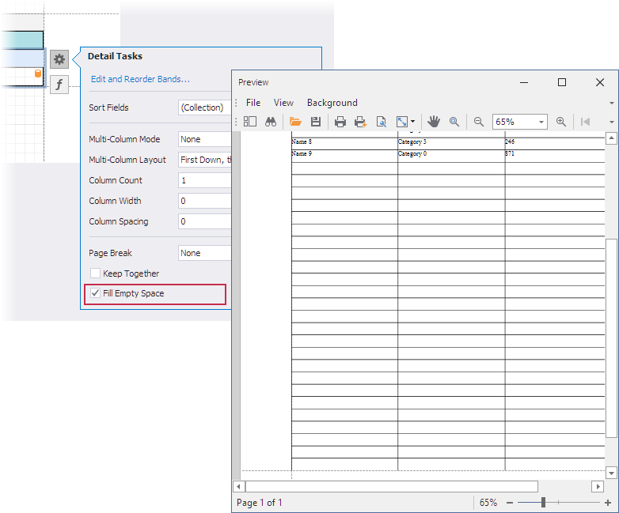

<!-- default badges list -->

<!-- default badges end -->
# Reporting for WinForms - Add Blank Rows and Fill Empty Space to the End of the Page

This example demonstrates the [DetailBand.FillEmptySpace](https://docs.devexpress.com/XtraReports/DevExpress.XtraReports.UI.DetailBand.FillEmptySpace) option that allows you to populate a report with blank rows and fill empty space between the [DetailBand](https://docs.devexpress.com/XtraReports/DevExpress.XtraReports.UI.DetailBand) and the next band or the end of the page. 

## Files to Review

* [Form1.cs](./CS/WindowsFormsApplication1/Form1.cs) (VB: [Form1.vb](./VB/WindowsFormsApplication1/Form1.vb))
* [XtraReport1.cs](./CS/WindowsFormsApplication1/XtraReport1.cs) (VB: [XtraReport1.vb](./VB/WindowsFormsApplication1/XtraReport1.vb))
* [Data.cs](./CS/WindowsFormsApplication1/Data.cs) (VB: [Data.vb](./VB/WindowsFormsApplication1/Data.vb))

## Documentation

- [Reporting – Populate Empty Space and Display Cross-Band Content (v19.2)](https://community.devexpress.com/blogs/reporting/archive/2019/10/28/reporting-populate-empty-space-and-display-cross-band-content-v19-2.aspx)
- [Populate the Empty Space](https://docs.devexpress.com/XtraReports/401300/create-popular-reports/create-a-report-with-cross-band-content-and-populated-empty-space#populate-the-empty-space)
<!-- feedback -->
## Does this example address your development requirements/objectives?

 

(you will be redirected to DevExpress.com to submit your response)
<!-- feedback end -->
